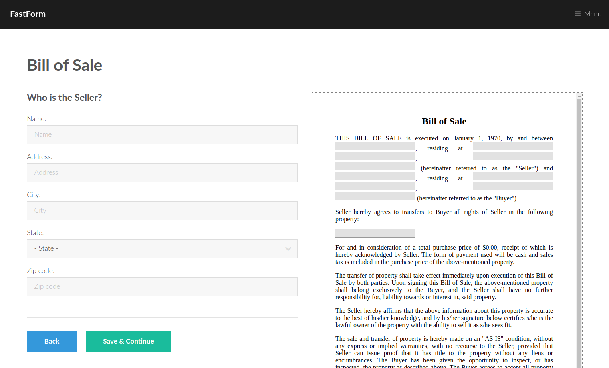
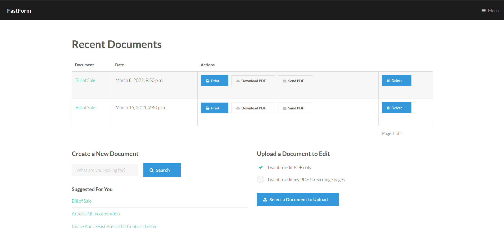
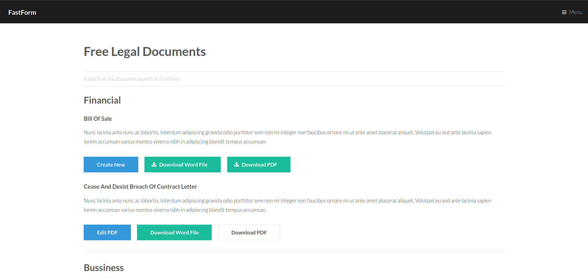

# FastForms

### [FastForm website](#) 

FastForm is a web app which allows users to build personilized legal documents such as bill of sale, tax forms, or invoices. Users are able to customize documents by answering a few questions. The app creates a document with all the the information filled out. The user is able to print or download a pdf version of the document.    
FastForms also lets users build forms from uploaded documents. Users are able to upload their own documents and then the web app builds an editable version of the document which users are able to fill and edit. Once the users are done editing, they are able to print or download a pdf version.   

The website was created using python, javascript, html, css, and mysql.   

See [INSTALLATION.md](INSTALLATION.md) for details on installing and running FastForm on your computer.    

If you want to contribute to this open source project, check out [CONTRIBUTING.md](CONTRIBUTING.md)    

## License

See the [LICENSE](LICENSE.md) file for license rights and limitations (MIT).    

   

   

   

